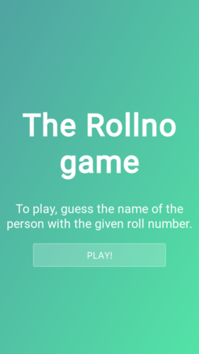
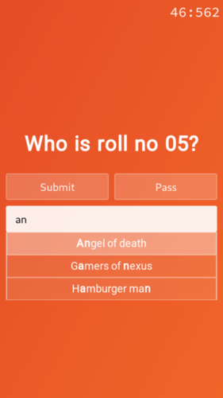
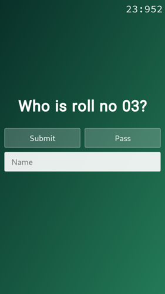
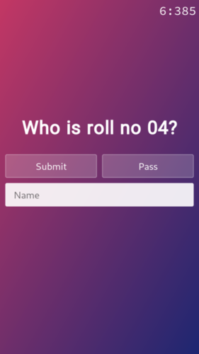
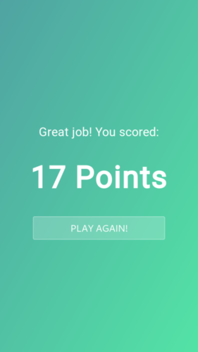
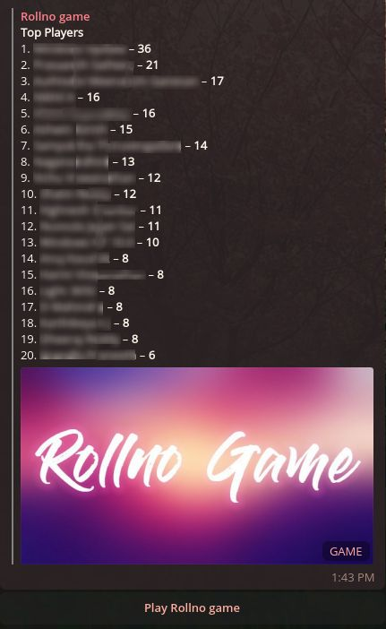

# Rollno-game

> A simple, beautiful telegram quiz game made using NodeJS and Express

## Screenshots

## Installation

1. Make sure you have node and npm installed. Only tested with Node v14+
2. Install dependencies using `npm i`
3. Add your server certificates `server.crt` and `server.key` in the `secrets` folder for https
4. Add your bot token and other configuration data to `secrets/config.js`
5. Add the list of roll numbers and corresponding names to `assets/js/data.js`. Check `data.sample.js` for an example on how the data structure.
6. `npm start` to start the webserver on port 443.
7. Set the telegram updates webhook to your server using [setWebhook](https://core.telegram.org/bots/api#setwebhook).

## Epilogue

This was a quick n dirty implementation of an idea I had. Originally, the `node-telegram-bot-api` library was used, but then this was later on refactored to use only express. Sharing the game with my class was a grand success! (Disclaimer: this may be a exaggeration)

Gradients from [uiGradients](https://github.com/Ghosh/uiGradients).
